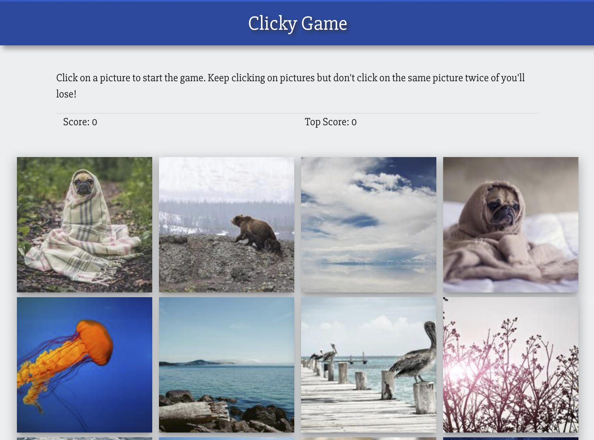

# Clicky Game

## Overview

In this game, the user will click on an image card.  The cards will shuffle with each click, and as long as the user clicks an image they have not clicked on before, they will increase their score.  If they click on an image card that has already been clicked, they will lose. This game was built using React.  The application's UI is broken down into components, component state is managed in the App.js file as well as functions handling click events.

### Technologies Used
* React

### Developer Information
Developed by Sylvia Jonon in Austin, TX.

